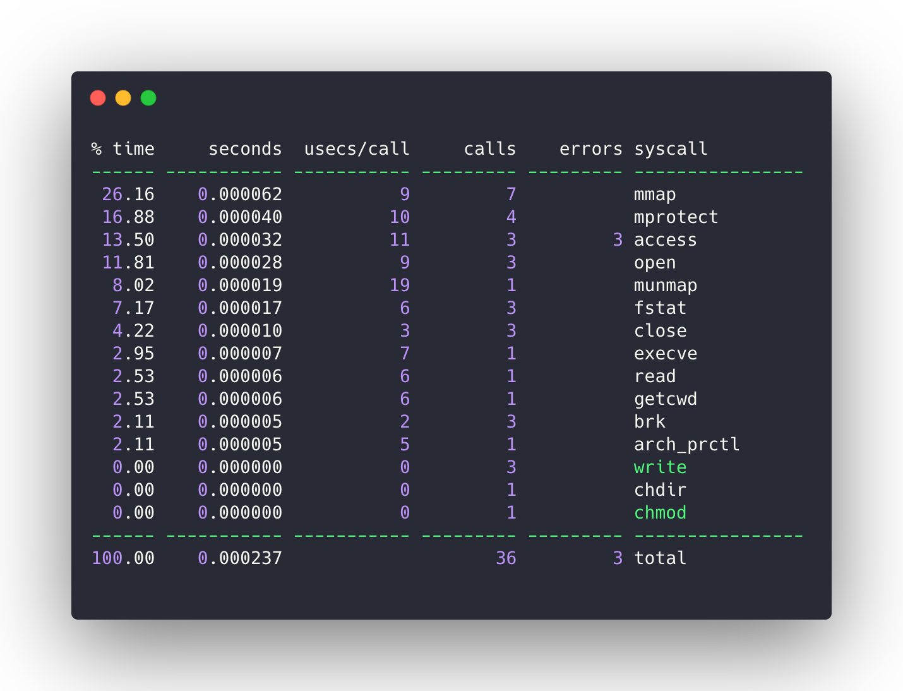
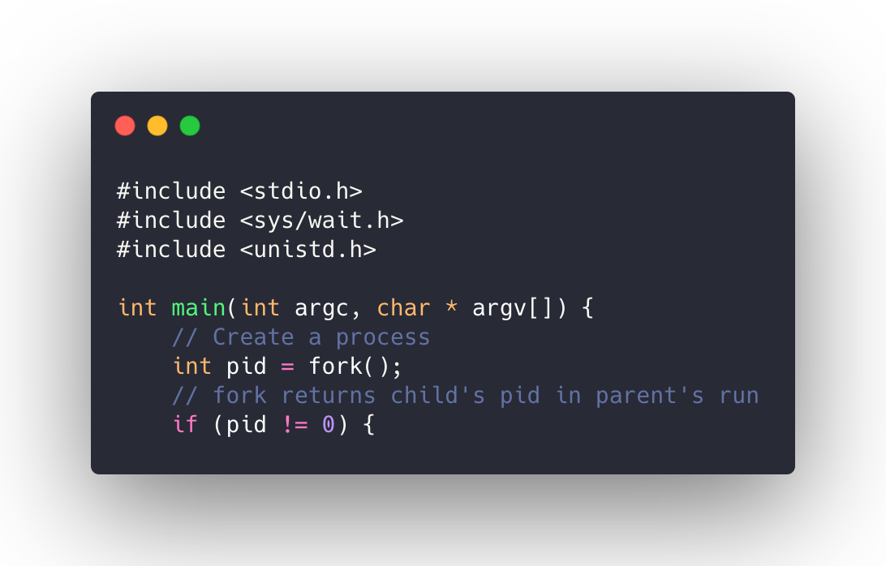
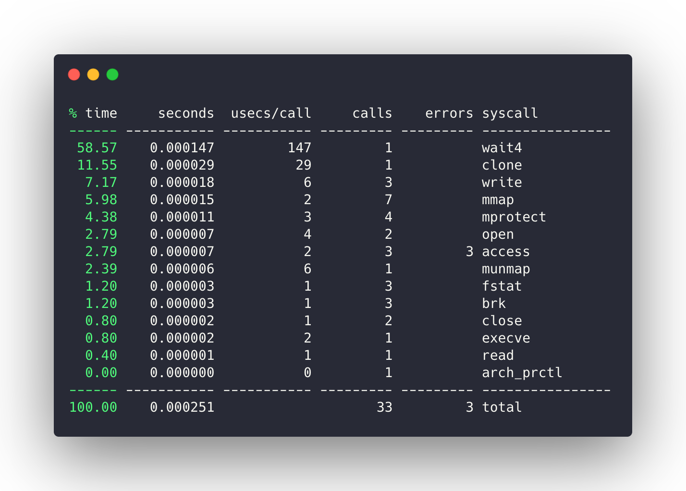
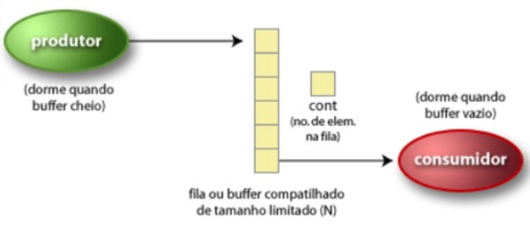
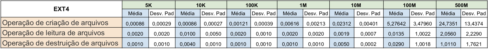
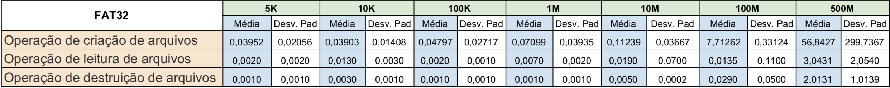
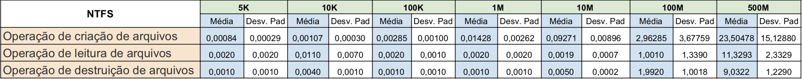
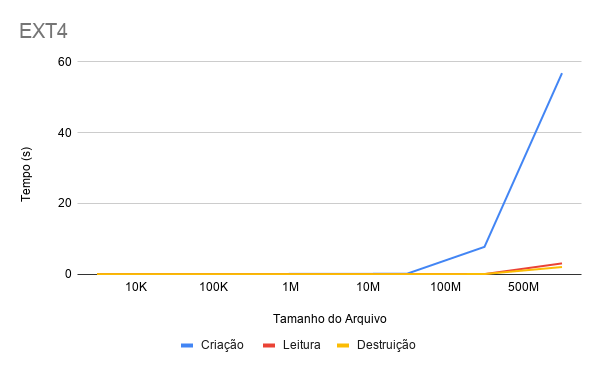
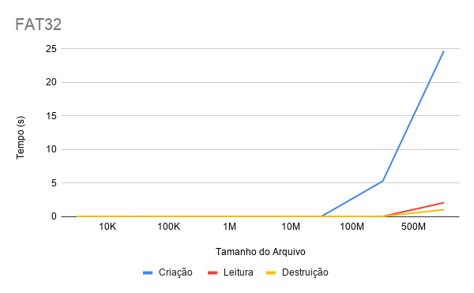
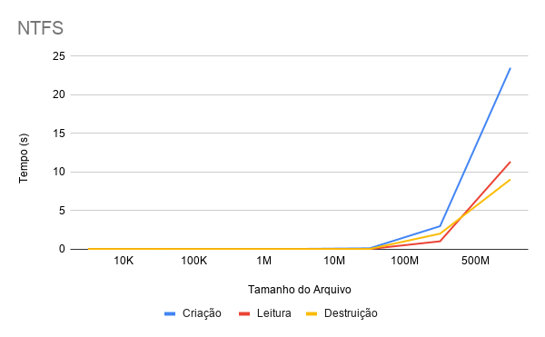

# SSC5723 Sistemas Operacionais - Grupo 1

Professor: Dr. Julio Cezar Estrella\
Alunos: Antonio Alessandro Rocha e Diego Frazatto Pedroso

***Módulo 1***
-------------------
***Chamadas de Sistema***
-------------------

Na computação, uma chamada de sistema ou **system call** é o mecanismo programático pelo qual um programa de computador solicita um serviço ao Kernel sobre o qual ele está sendo executado. Isto inclui serviços relacionados ao hardware, como acessar um periférico), criação e execução de novos processos e comunicação com serviços do núcleo de maneira integral como escalonamento do processador. 


Ferramentas e Tecnologias
-------------------
Todas os elementos apresentados pelo autores neste trabalho forem criados e testados utilizando uma máquina virtual Linux com a distribuição Ubuntu 16.04.6 LTS.

1. ***GCC***

A GCC [2] inclui front-ends para C além de diversas bibliotecas, foi originalmente escrito como o compilador para o sistema operacional GNU. Todos os códigos utilizandos para operar as chamadas de sistemas foram compilados utilizando o compilador GCC, utilizando o seguinte comando para geração dos executáveis.

````
gcc code.c -o bin_name
````

2. ***Strace***

O Strace [1] é uma ferramenta que monitora as chamadas de sistema e os sinais recebidos pela aplicação. A maneira mais comum de executá-la é passando a aplicação a ser monitorada como parâmetro, como no exemplo abaixo.

````
strace -o analytics/processo/open_sc -e open bin/processo
````

Por padrão, o Strace exibe todas as chamadas do sistema para o binário especificado. Para exibir apenas uma chamada de sistema específica, utilizou-se o parâmetro -e. Para ambos os exemplos também se fez uso do parâmetro -o, que redireciona a saída do comando para um arquivo

Usando o parâmetro -c, o Strace fornece um relatório estatístico útil para o rastreamento de execução

````
strace -o analytics/processo/stats.txt -c open bin/processo
````

A coluna "calls" na saída a seguir indica quantas vezes essa chamada específica do sistema foi executada.





No trecho do código processo.c, temos a chama de sistema ***fork()***.




Na análise do binário utilizando o Strace, a chamada de sistema fork() não aparece como uma chamada dentro do log do Strace. 

Ocorre que, a chamada fork() quando escrita na linguagem C, utiliza a biblioteca glibc [3], que por sua vez implementa o fork() como um wrapper da chamada de sistema Clone, que podem ser observadas abaixo.



Na coluna "syscall" é possível observar a chamada de sistema clone, que implementa o fork() em baixo nível.


***Processos CPU-bound e I-O bound***
-------------------

Na computação, I-O bound é um termo utilizado para designar os sistemas que fazem uso intensivo de entrada e saída. Todos os sistemas operacionais executam processos de entrada e saída. Por exemplo, quando algum usuário quer copiar um arquivo para algum periférico (pen drive). Esses processos são conhecidos como I/O bound porque fazem pouco uso da CPU. Por outro lado, existem processos conhecidos como CPU bound, que fazem muito uso da CPU, a citar alguns jogos eletrônicos que utilizam recursos gráficos em 3D de alta complexidade.


Utilizamos um comando nativo do Linux para aferir os tempos de execução de cada binário.

```
time /bin/io_bound
```

O Linux é projetado de tal forma que ele examina o cache de disco antes de examinar o disco, portanto se encontrar o recurso solicitado no cache, a solicitação não atingirá o disco; E no caso de limparmos o cache, o sistema operacional procurará o recurso no disco novamente, não causando perdas ou problemas para o próprio sistema ou o usuário. Os comandos abaixo fazem uma limpeza da memória cache sem que você precise reiniciar o sistema operacional.

```
echo 3 > /proc/sys/vm/drop_caches
````

```
sysctl -w vm.drop_caches=3
```

Foram executadas várias rodadas de testes, os resultados de tempo de execução eram inseridos juntamente aos comandos de limpeza de cache, para que a alta repetição dos comandos não intereferisse no resultado do experimento. No total foram executados 166 rodadas para cada binário, abaixo vemos o resultado do cpu_bound. As medidas estatísticas análisadas foram: média aritmética, percentil 99 (com o objetivo de eliminar outliers) e o desvio padrão dos elementos da amostra.

|      | media    | p99      | desvpad  |
|------|----------|----------|----------|
| real | 0m0.003s | 0m0.005s | 0m0.001s |
| user | 0m0.005s | 0m0.005s | 0m0.001s |
| sys  | 0m0.001s | 0m0.000s | 0m0.001s |

Os valores do binário io_bound seguiram os mesmo critérios de avaliação, e podem ser observador na tabela abaixo.

|      | media    | p99      | desvpad  |
|------|----------|----------|----------|
| real | 0m0.248s | 0m0.230s | 0m0.127s |
| user | 0m0.186s | 0m0.170s | 0m0.007s |
| sys  | 0m0.023s | 0m0.019s | 0m0.008s |


Paralelamente, fizemos outra análise utilizando o mesmo comando, porém a chamada é de outra forma.
Quando executa o comando time, um comando shell incorporado [e executado, e esse comando não suporta todos os recursos.

O comando /usr/bin/time é executado em tempo real do GNU Linux.

Alguns parametros adicionais foram passando na execução do comando para facilitar a extração e análise das informações.

```
/usr/bin/time --format="Uso de %P da CPU\n%Ss em modo kernel\n%Us em modo usuário\n%c Trocas de contexto involuntárias\n%w Trocas de contexto voluntárias" ./io_bound
```
Em sistemas operacionais, uma troca de contexto é o processo que consiste em armazenar e restaurar o estado (contexto) de uma CPU de forma que múltiplos processos possam compartilhar a mesma CPU. Garante-se que, quando o contexto anterior armazenado seja restaurado, o ponto de execução volte ao mesmo estado que foi deixado durante o armazenamento.


Para o binário cpu_bound temos:

Uso de 90% da CPU\
0.00s em modo kernel\
0.00s em modo usurio\
5 Trocas de contexto involuntárias\
1 Trocas de contexto voluntárias

Para o binário io_bound temos:

Uso de 99% da CPU\
0.01s em modo kernel\
0.19s em modo usurio\
20 Trocas de contexto involuntárias\
1 Trocas de contexto voluntárias


***Módulo 2***
-------------------
***Produtor Consumidor***
-------------------

O problema do Produtor e o Consumidor consiste em um conjunto de processos que compartilham um mesmo buffer. Os processos chamados produtores colocam informação no buffer. Os processos chamados consumidores retiram informação deste buffer. 

Esse trabalho busca exemplificar de forma clara, situações de impasses que ocorrem no gerenciamento de processos de um Sistema Operacional



Para garantir o acesso a essas variáveis e garantir o sincronimos vamos utilizar semáforos. De forma análoga ao semáforo de trânsito, na computação é um componente que tem como função o controle de acesso a recursos compartilhados num ambiente multitarefa. Esta variável pode ser manipulada através de duas primitivas atómicas, isto é, que não podem ser interrompidas por processos.

As principais operações sobre semáforos são:

Inicialização
-------------------
Recebe como parâmetro um valor inteiro indicando a quantidade de processos que podem aceder a um determinado recurso.

Operação wait
-------------------
Decrementa o valor do semáforo. Se o semáforo está com valor zero, o processo é colocado em modo espera. Para receber um sinal, um processo executa o wait e bloqueia se o semáforo impedir a continuação da sua execução.

Operação signal
-------------------
Se o semáforo estiver com o valor zero e existir algum processo em espera, um processo será acordado. Caso contrário, o valor do semáforo é incrementado. Para enviar um sinal, um processo executa um signal.

A solução desse problema utilizou a biblioteca **pthreads** [6], a qual possibilita a programação de forma concorrente com as funções de: controle de threads, criação de threads, suspensão de threads, execução e controle de exclusão mútua por semáforos binários, para controle da seção crítica. 


***Compartilhamento de Buffer***
-------------------

Para controlarmos o acesso a essas variáveis e garantir o sincronismo nas operações, foram utilizados semáforos [6].

Na criação do buffer no arquivo (lista.h) 

A dimensão do buffer é denifida dinamicamente, o usuário define o tamanho na inicialização do programa.

A função ***getSemaphore*** [4] forcene acesso aos semárofos daquela região crítica, sendo eles o MUTEX para o semáforo binário, FULL e EMPTY para Produtor e Consumidor.


Para compilação do código:
````
gcc main.c lista.c -pthread -o main
````

Basicamente 3 parâmetros precisam ser fornecidos, são eles:
1. Tamanho do Buffer
2. Numero de threads Produtores
3. Número de threads Consumidores


O programa inicializa com o buffer vazio, se alguma thread consumidora tentar entrar na região crítica será bloqueada pelo semáforo, umas vez que não ha nada no buffer e nada pode ser consumido.
Apenas então quando o primeiro Produtor inserir algum dado no buffer, o semáforo associado, FULL, vai ser incrementado e threads consumidoras que estavam bloqueadas vão para o estado de pronto, podendo ou não ser escalonadas logo em seguida.

Os semáforos atuam apenas nas threads produtoras e consumidoras, a thread main não é afetada. 

Através da função pthread_join permite que a thread main aguarde o termino das outras threads (consumidor e produtor).cEssa função também permite que a thread não seja escalonada para main, e finalize todos os processos e as threads associadas a esses processos.

Caso o buffer fosse inicializado de forma oposta, ou seja, cheio. Se a primeira thread fosse um produtor, iria tentar inserir algum dado, e seria bloqueado pelo semáforo pelo fato de o buffer estar cheio. Teria que aguardar então o escalonamento de um Consumidor que iria remover um elemento do buffer.


***Módulo 3***
-------------------
***Simulador de Gerenciamento de Memória Virtual com Paginação***
-------------------

Na computação, memória virtual é uma técnica utiliza a memória secundária como cache para armazenamento secundário. As premissas para essa abordagem foram, em primeiro lugar, permitir o compartilhamento seguro e eficiente da memória entre vários programas e também remover os transtornos de programação de uma quantidade pequena e limitada na memória principal.

As funções básicas da memória virtual são:
* Paginação ou swapping, que possibilita a uma aplicação utilizar mais memória do que a fisicamente existente na memória da máquina;
* Realocação para assegurar que cada aplicação tenha o seu próprio espaço de endereçamento;
* Proteção para impedir que um processo utilize um endereço de memória que é destinado a outro componente, ou não lhe pertença.

Ferramentas e Tecnologias
-------------------
Todas os elementos apresentados pelo autores neste trabalho forem criados e testados utilizando uma máquina virtual Linux com a distribuição Ubuntu 16.04.6 LTS.

Exclusivamente para esse módulo, utilizamos a linguagem C++ para conter o excesso de estrutuda de dados que teriam de ser implementadas na linguagem C.

No arquivo **Properties.h** temos a classe *Properties* para ler o arquivo de configuração da MMU e extrair os valores para o construtor da classe MMU.

No arquivo **Mmu.h** define e classe implementada dentro do arquivo **Mmu.cpp**, na qual a Unidade de Gerenciamento de Memória é desenvolvida. Esse componente traduz endereços virtuais em endereços físicos. A memória principal está separada entre a memória física e a memória lógica. Na primeira,a memória é implementada em circuitos digitais e é nela que a memória lógica é fisicamente armazenada, geralmente a memória lógica é maior do que a memória física. 

O simulador faz leitura do arquivo **simulation** linha a linha, coletando endereços de memória (binários) e são feitos os acessos de página, partindo do princípio que as páginas estão vazias, por esse motivo ocorre page fault nas primeiras páginas. Os tipos de acesso que interpretados pelo simulador são de escrita (W) e leitura (R).

O simulador faz leitura do arquivo **simulation.txt** linha a linha, coletando endereços de memória (binários) e são feitos os acessos de página, partindo do princípio que as páginas estão ausentes, por esse motivo ocorre falta de página nas primeiros acessos às páginas. Os tipos de acesso interpretados pelo simulador são de escrita em um endereço (W), leitura em um endereço (R), execução de uma instrução em um endereço (I) e acesso a um dispositivo de E/S.

Vale lembrar que uma falta de página, no contexto de gerenciamento de memória, é uma interrupção disparada pelo hardware quando um programa acessa uma página mapeada no espaço de memória virtual, mas que não foi carregada na memória física do computador.

Toda vez que uma instrução é lida, exibe-se a página caso ela seja encontrada, caso contrário é disparado o page fault. Nesse caso, caso a memória física esteja cheia, a página que foi escolhida pelo algoritmo de substituição de páginas para sair da RAM é exibida e a nova é carregada do disco para a memória.

O algoritmo LRU [7] implementa um contador C de 64 bits incrementado a cada instrução (em hardware), cada entrada da tabela de páginas deve ter um campo extra para armazenar o valor do contador (campo C). A cada referência à memória o valor corrente de C é armazenado na entrada da tabela de páginas na posição correspondente à página referenciada. Quando ocorre uma falta de página, a tabela de páginas é examinada e a entrada cujo campo C é de menor valor é a escolhida a ser substituída.

No arquivo **config.cfg** os parâmetros ***“page_size”***, ***“logical_adress_size”***,***“physical_memory_size”***, ***“replacement_algorithm”*** e ***“swap_size”*** são fornecidos. Na paginação a memória física é dividida em blocos de bytes contíguos denominados molduras de páginas, geralmente com tamanho de 4 KiB. Por exemplo, se o usuário desejar o valor default dos blocos o parâmetro ***page_size***  deve ser igual a 4096 (2^12).

Além de instruções de acesso a memória e dispositivos, há também a de criação de processos. Nesse caso, o simulador checará se há espaço disponível para a sua devida alocação, ou seja, se há espaço na RAM ou se algum processo pode ser movido para a área de swap. Caso contrário, o processo não é criado e a simulação é abortada.

Para compilar os códigos utilizamos o compilador ***g++***[8] através do comando:
````
$ g++ *.cpp -o main
````
Exemplo do simulador em execução:

````
$ ./main
````
Saída para a configuração e simulação dada no repositório.
````
------------------------------------------------------------
Replacement algorithm: LRU
Page size (in bits): 4096
Physical memory size (in pages): 4
Swap area size (in pages): 8
Logical address size (in bits): 16
------------------------------------------------------------
P1 C 2

Process 1 created successfully
------------------------------------------------------------
P1 R 0010000000000000

Process 1 accessing memory at 0010000000000000
Page fault 2!
------------------------------------------------------------
P1 R 0101001000000000

Process 1 accessing memory at 0101001000000000
Page fault 5!
------------------------------------------------------------
P1 P 0010000100010000

Process 1 running instruction at 0010000100010000
Page 2 found!
------------------------------------------------------------
P1 R 0001000000000010

Process 1 accessing memory at 0001000000000010
Page fault 1!
------------------------------------------------------------
P1 P 0101000000000010

Process 1 running instruction at 0101000000000010
Page 5 found!
------------------------------------------------------------
P1 W 0010001000000000

Process 1 accessing memory at 0010001000000000
Page 2 found!
------------------------------------------------------------
P7 C 3

Process 7 created successfully
------------------------------------------------------------
P7 R 0100011111111111

Process 7 accessing memory at 0100011111111111
Page fault 4!
------------------------------------------------------------
P7 R 0101001100100000

Process 7 accessing memory at 0101001100100000
Page 5 found!
------------------------------------------------------------
P7 I 1111000000000010

Process 7 accessing device 61442
------------------------------------------------------------
P7 R 0011001100100001

Process 7 accessing memory at 0011001100100001
Page fault 3!
Page 1 removed from RAM
------------------------------------------------------------
P7 W 0010100000000000

Process 7 accessing memory at 0010100000000000
Page 2 found!
------------------------------------------------------------
P1 R 0101000000000011

Process 1 accessing memory at 0101000000000011
Page 5 found!
------------------------------------------------------------
P1 R 0010000000000100

Process 1 accessing memory at 0010000000000100
Page 2 found!
------------------------------------------------------------
P1 W 1111010000000001

Process 1 accessing memory at 1111010000000001
Page fault 15!
Page 4 removed from RAM
------------------------------------------------------------
P1 W 1001010000000010

Process 1 accessing memory at 1001010000000010
Page fault 9!
Page 3 removed from RAM
------------------------------------------------------------
P1 P 0101111111111111

Process 1 running instruction at 0101111111111111
Page 5 found!
------------------------------------------------------------
P2 C 4

Process 2 created successfully
------------------------------------------------------------
P3 C 4

Memory is full! Process could not be created!
Aborting...
````


***Módulo 4***
-------------------
***Sistemas de Arquivos***
-------------------

Na computação, um sistema de arquivos é um conjunto de estruturas lógicas e de rotinas, que permitem ao sistema operacional controlar o acesso ao disco rígido. Diferentes sistemas operacionais usam diferentes sistemas de arquivos. Conforme cresce a capacidade dos discos e aumenta o volume de arquivos e acessos, esta tarefa torna-se mais e mais complicada, exigindo o uso de sistemas de arquivos cada vez mais complexos e robustos.


Ferramentas e Tecnologias
-------------------
Todas os elementos apresentados pelo autores neste trabalho forem criados e testados utilizando uma máquina virtual Linux com a distribuição Ubuntu 16.04.6 LTS.

1 - ***NTFS***

O NTFS [9] foi desenvolvido quando a Microsoft decidiu criar o Windows NT: como o WinNT deveria ser um sistema operacional mais completo e confiável, o FAT não servia como sistema de arquivos por causa de suas limitações e falta de recursos Anteriormente, ela já havia tentado fazer isso em parceria com a IBM, lançando o OS/2 - no entanto as duas empresas divergiam em certos pontos e acabaram quebrando a aliança. 

O OS/2 usava o sistema de arquivos HPFS (High Performance File System - Sistema de Arquivos de Alta Performance), cujos conceitos acabaram servindo de base. O NTFS possui uma estrutura que armazena as localizações de todos os arquivos e diretórios, incluindo os arquivos referentes ao próprio sistema de arquivos denominado MFT (Master File Table).

2 - ***FAT32***

O FAT32 [10] (File Allocation Table ou Tabela de Alocação de Arquivos) é um sistema de arquivos que gerencia o acesso a arquivos em HDs e outras mídias. Criado em 1996 pela Microsoft para substituir o FAT16 usado pelo MS-DOS e com uma série de limitações. O FAT32 foi implementado nos sistemas Windows 95 (OSR2), Windows 98 e Millennium e ainda possui compatibilidade com os sistemas Windows 2000 e Windows XP, que utilizam um sistema de arquivos mais moderno, o NTFS, que foi continuado, sendo usado também nos sistemas Windows Vista, Windows 7 e Windows Server 2008 R1/R2 (para servidores empresariais).


3 - ***EXT4***

O primeiro sistema de arquivos suportado pelo Linux foi o Minix. Ele apresentava alguns problemas de desempenho significativos e, assim, foi criado outro sistema de arquivos, especificamente para o Linux, denominado sistema de arquivos estendido. O primeiro sistema de arquivos estendido (ext) foi projetado por Remy Card e introduzido no Linux em abril de 1992. O sistema de arquivos ext foi o primeiro a utilizar o comutador do Sistema de Arquivo Virtual (VFS) implementado no kernel 0.96c e suportava sistemas de arquivos de até 2 gigabytes (GB). 

O Ext4 [11] apresenta inúmeros novos aprimoramentos quanto a desempenho, escalabilidade e confiabilidade. Mais especificamente, o ext4 suporta sistemas de arquivos de 1 exabyte. Ele foi implementado por uma equipe de desenvolvedores, liderados por Theodore Tso (responsável pela manutenção do ext3) e introduzido no kernel 2.6.19. Encontra-se agora estável no kernel 2.6.28 (desde dezembro de 2008). 

O ext4 pega emprestado vários conceitos úteis de muitos sistemas de arquivos concorrentes. Por exemplo, a abordagem baseada em extensões para o gerenciamento de blocos foi implementada no JFS. Outro recurso relativo ao gerenciamento de blocos (alocação com atraso) foi implementado tanto no XFS quanto no ZFS da Sun Microsystems.

Com bases nos sistemas de arquivos citados, esse trabalho visa uma análise
envolvendo as seguintes operações: 

- Operação de criação de arquivos;
- Operação de leitura de arquivos;
- Operação de destruição de arquivos; 

Para arquivos com tamanhos de:
- 5Kb
- 10Kb
- 100Kb
- 1Mb
- 10Mb
- 100Mb
- 500MB

O comando **dd** são as iniciais de Data Definition, é um utilitário de linha de comando que em primeiro lugar, tem como principal função converter e copiar arquivos. Esse programa foi utilizado para gerar os respectivos arquivos em um determinado path.

````
dd if=/dev/zero of=/media/linux/device/file.img bs=5k count=1
````
Onde **if** é origem do arquivo, **of** o destino, **bs** é o tamanho do bloco, e **count** a quantidade de blocos. 

Para a remoção de arquivo, foi utilizado o comando **rm**, que exclui um arquivo. E para a leitura, o comando **cat** foi usado. Esse comando concatena arquivos passados como argumento e exibe na saída padrão. Aproveitando os insumos do primeiro módulo, utilizamos o comando **time** para aferir o tempo de leitura e destruição dos arquivos.

Como a linguagem de programação  não foi especificada, utilizamos o Shell do prompt de comando para fazer o loop de execução.

O nosso código executa um loop que escreve, lê e remove, de forma automática. Executamos todas as rotinas de forma programada e com extrema consistência entre as execuções.


***Análise dos Dados***
-------------------

Foram realizadas várias rodadas de testes com cada tipo de sistema de arquivos. A tabela abaixo mostra os valores coletados dos testes, esses valores foram sumarizados em média e desvio padrão. Cada experimento teve pelo menos, 40 rodadas de execução para cada um dos cenários apresentados.



**Tabela 1 - Tabela de dados do sistema de arquivos EXT4**


**Tabela 2 - Tabela de dados do sistema de arquivos FAT32**


**Tabela 3 - Tabela de dados do sistema de arquivos NTFS**


Com base nas Tabelas 1, 2 e 3, foram gerados alguns gráficos, com a finalidade de comparar os tipos de operações e os tamanhos dos arquivos manipulados por cada sistema.

\
**Grafico 1 - Gráfico comparativo das operações do sistema de arquivos EXT4**

\
**Grafico 2 - Gráfico comparativo das operações do sistema de arquivos FAT32**

\
**Grafico 3 - Gráfico comparativo das operações do sistema de arquivos NTFS**


Nota-se que, em todos os casos, conforme esperado, quanto maior a arquivo que a operacao tinha que manipular, maior seria o tempo. Porém todos os sistemas de arquivos tem uma boa performance até arquivos de 100M. A partir desses valores, os tempos de operação são de ordem exponenciais. O desvio padrão tambem tende a ser maior entre as operações com arquivos maiores, pelo fato dessas operacoes levarem mais tempo, os recursos da máquina, bem como o sistema operacional, precisam lidar com outras operações que ocorrem de forma concorrente no sistema, o que explica um aumento considerável no tempo para operações com arquivos maiores que 10M.


Referências
-------------------
1. http://man7.org/linux/man-pages/man1/strace.1.html
2. https://gcc.gnu.org/
3. https://thorstenball.com/blog/2014/06/13/where-did-fork-go/
4. https://lisha.ufsc.br/teaching/dos/ine5357-2004-1/work/g4/sincronismo/design.htm
5. http://www.yolinux.com/TUTORIALS/LinuxTutorialPosixThreads.html
6. https://pubs.opengroup.org/onlinepubs/7908799/xsh/pthread.h.html
7. https://www.inf.ufes.br/~zegonc/material/Sistemas_Operacionais
8. https://www.geeksforgeeks.org/compiling-with-g-plus-plus/
9. http://dubeyko.com/development/FileSystems/NTFS/ntfsdoc.pdf
10. http://read.pudn.com/downloads77/ebook/294884/FAT32
11. https://www.kernel.org/doc/html/latest/filesystems/ext4/index.html


Contatos 
-------------------
antonio.alessandro@usp.br\
diegopedroso@usp.br